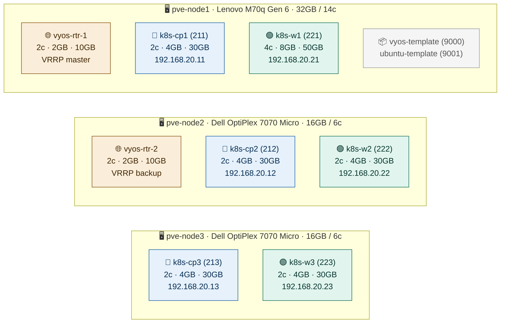
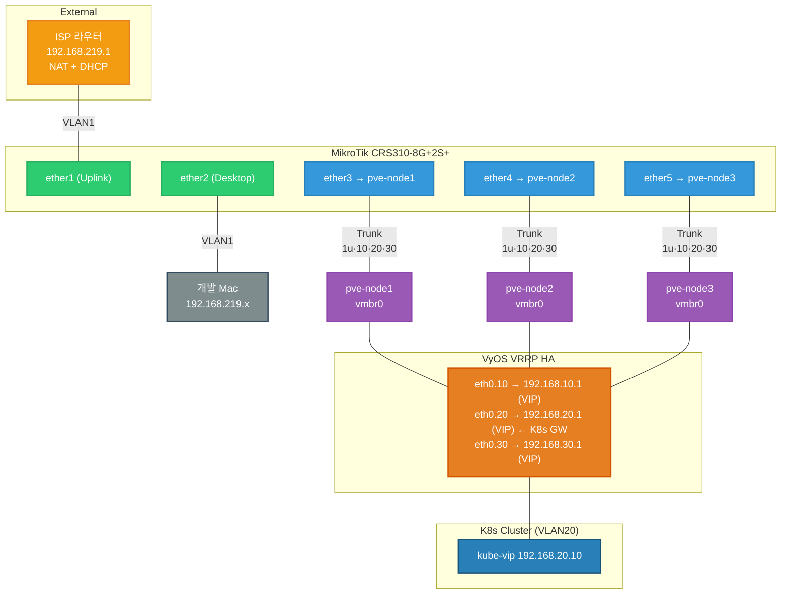

# Homelab IaC

Proxmox VE 3노드 위에 VyOS HA 라우터와 Kubernetes HA 클러스터를
Terraform + Packer + Ansible로 완전 자동화한 홈랩 인프라입니다.

---

## 기술 스택

| 레이어 | 기술 | 역할 |
|---|---|---|
| 하이퍼바이저 | Proxmox VE | 3노드 클러스터 |
| 템플릿 빌드 | Packer + Ansible | VyOS / Ubuntu 템플릿 자동화 |
| 인프라 프로비저닝 | Terraform (bpg/proxmox) | VM 생성 + 설정 |
| 라우터 | VyOS (rolling) | VLAN 라우팅, NAT, VRRP HA, BGP |
| 쿠버네티스 | kubeadm 1.32 + stacked etcd | 3 CP + 3 Worker HA 클러스터 |
| VIP 관리 | kube-vip v0.8.7 | API server HA VIP (ARP + k8s lease) |
| CNI | Cilium 1.17 | eBPF native routing, kube-proxy 대체, BGP |
| 컨테이너 런타임 | containerd 2.x | SystemdCgroup 설정 |

---

## 활성화된 주요 기능

### VyOS HA (VRRP)
- vyos-rtr-1(master) / vyos-rtr-2(backup) 이중화
- VRID 10/20/30, sync-group ALL, 광고 주기 1s
- **근거**: 라우터 단일 장애점 제거. master 다운 시 1~2초 내 backup이 VIP 인계

### Cilium eBPF Native Routing
- kube-proxy 제거 (`kubeProxyReplacement=true`)
- `routingMode=native`: VXLAN 터널링 없이 L3 직접 라우팅
- `bpf.masquerade=true`: iptables 대신 eBPF로 SNAT
- **근거**: iptables 규칙 수가 서비스에 비례해 증가하는 문제 해결. 홈랩이지만 실제 기술 학습 목적

### Cilium BGP Control Plane
- 각 노드가 자신의 Pod CIDR을 VyOS에 BGP로 광고
- VyOS가 Pod CIDR 라우트를 학습 → 외부에서 Pod IP 직접 접근 가능
- **근거**: LoadBalancer 서비스 없이도 내부 네트워크에서 Pod에 직접 접근, L3 라우팅 학습

### Hubble 네트워크 가시성
- Cilium 내장 Hubble Agent + Relay + UI 활성화
- 실시간 서비스 간 네트워크 플로우 시각화
- DNS, HTTP, TCP, 드롭 패킷 메트릭 수집
- **근거**: eBPF 기반 관찰이라 iptables 룰 없이 커널 레벨에서 패킷 추적 가능. 네트워크 정책 디버깅에 유용

### kube-vip Lease 기반 HA
- k8s lease로 리더 선출 → 단일 노드만 VIP 보유
- kube-vip.conf에 노드 자신의 IP 기재 → 재부팅 후 VIP 없이도 API 서버 연결 가능
- **근거**: 노드 재시작 후 닭-달걀 문제(VIP 없이 API 연결 불가) 해결

---

## VM 배치 토폴로지

**K8s VIP**: `192.168.20.10` (kube-vip) · **API server**: `https://192.168.20.10:6443`

---

## 네트워크 토폴로지

**VLAN 대역:**
- `VLAN1` 192.168.219.x — 관리망 (ISP)
- `VLAN10` 192.168.10.0/24 — mgmt
- `VLAN20` 192.168.20.0/24 — K8s 클러스터
- `VLAN30` 192.168.30.0/24 — storage (예정)

---

## 문서

| 문서 | 내용 |
|---|---|
| [docs/setup.md](docs/setup.md) | **처음부터 따라하는 셋업 가이드** |
| [docs/ARCHITECTURE.md](docs/ARCHITECTURE.md) | 코드베이스 구조 학습 가이드 |
| [docs/kube-vip-bootstrap.md](docs/kube-vip-bootstrap.md) | kube-vip HA 설계 및 트러블슈팅 |
| [docs/bgp-peering.md](docs/bgp-peering.md) | VyOS ↔ Cilium BGP 피어링 |
| [docs/cilium-ebpf.md](docs/cilium-ebpf.md) | Cilium eBPF 구성 상세 |
| [docs/nic-hang-fix.md](docs/nic-hang-fix.md) | Intel I219-LM NIC 행업 처치 |
| [docs/REFACTORING.md](docs/REFACTORING.md) | IaC 리팩토링 기록 |

---

## 개발 이력

Phase 0: VyOS Template 수동 제작

- [x] VyOS Rolling ISO에 cloud-init 부재 확인
- [x] Default apt repo 비활성 상태에서 외부 repo 일회성 활용
- [x] qemu-guest-agent 설치로 PVE → guest IP 자동 발견
- [x] Bootstrap config로 clone 후 즉시 SSH 도달 가능
- [x] Template lock + cloud-init drive 부착
- [x] Clone 검증 완료

Phase 1: Terraform 첫 번째 VM 프로비저닝

- [x] PVE API 토큰 발급 (terraform@pve!provisioner)
- [x] bpg/proxmox provider 0.66 설치 + 인증
- [x] Template clone 첫 사이클 (apply 0 error)
- [x] Guest agent 통한 IP 자동 발견
- [x] SSH 도달성 검증

Phase 2: vyos-rtr-1 네트워크 설정

- [x] Hostname, VLAN sub-interface (eth0.10/20/30)
- [x] NAT masquerade (vlan10/20/30 → eth0)
- [x] Firewall state-policy
- [x] External SSH 유지 (vlan1 DHCP fallback)

Phase 3: VRRP HA 이중화

- [x] Master(priority 200) / Backup(priority 100) 분리
- [x] VRID 10/20/30 매칭
- [x] Sync-group ALL 동작 확인
- [x] Failover 검증

Phase 4: IaC 리팩토링 + VyOS 템플릿 자동화

**Terraform 모듈화**
- [x] 평면 구조 → `modules/vyos-router/` 분리
- [x] `role = "master"|"backup"` 변수로 VRRP 우선순위 자동 계산
- [x] `cidrhost()`로 NAT 소스 네트워크 동적 유도
- [x] `moved {}` 블록으로 state 무중단 마이그레이션

**Packer + Ansible — VyOS 템플릿 자동화**
- [x] `proxmox-iso` builder: ISO → VM → template 변환
- [x] `boot_command`로 `install image` 대화형 자동 응답
- [x] `build_ip` 고정 IP + `ssh_host`로 guest-agent 없이 SSH
- [x] Ansible: hostname, timezone, DNS, qemu-guest-agent 설치/검증
- [x] DHCP 리셋으로 build_ip 잔류 방지

Phase 5: K8s HA 클러스터 + Cilium BGP

**Ubuntu 템플릿 자동화**
- [x] Packer autoinstall + Ansible (containerd, kubeadm 사전 설치)
- [x] cloud-init으로 정적 IP / SSH key 주입

**K8s 클러스터 (kubeadm + stacked etcd)**
- [x] 3 Control Plane + 3 Worker 배포
- [x] kube-vip ARP + k8s lease HA
- [x] kube-vip.conf (노드 IP 서버) 재부팅 안전성 확보

**Cilium eBPF**
- [x] kube-proxy 완전 대체
- [x] Native routing + BPF masquerade
- [x] BGP Control Plane → VyOS 피어링 (AS 65000 ↔ 65001)
- [x] 6/6 노드 Pod CIDR BGP 광고 확인

