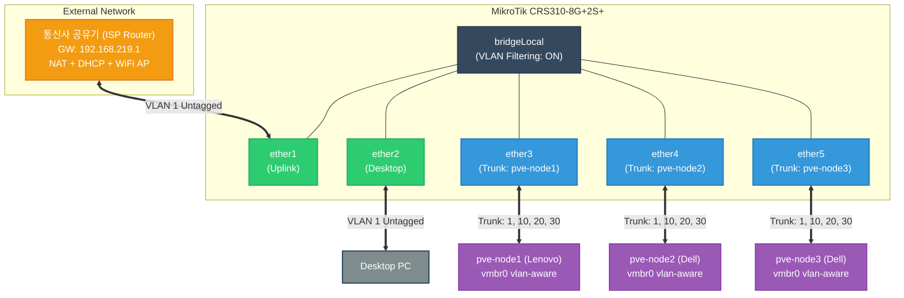

# Homelab
<!-- toc -->

- [Todo](#todo)
  - [Phase0](#phase0)
  - [Phase1](#phase1)
  - [Phase2](#phase2)
  - [Phase3](#phase3)

<!-- tocstop -->

## 네트워크 토폴로지

## Todo
### Phase0
- [x] VyOS Rolling generic ISO에 cloud-init 부재 확인
- [x] Default apt repo 비활성 상태에서 외부 repo 일회성 활용
- [x] qemu-guest-agent 설치로 PVE → guest IP 자동 발견 가능
- [x] Bootstrap config로 clone 후 즉시 SSH 도달 가능
- [x] Template lock + cloud-init drive 부착
- [x] Clone 검증 (998)으로 모든 흐름 통과 확인

### Phase1
- [x] PVE API 토큰 (terraform@pve!provisioner) 발급
- [x] Terraform Level 2.5 평면 구조 빌드
- [x] bpg/proxmox provider 0.66 설치 + 인증 동작
- [x] Template clone 첫 사이클 (apply 0 error)
- [x] Guest agent 통한 IP 자동 발견 (ipv4_addresses output)
- [x] External SSH 도달성 검증
- [x] VM 안에서 외부 ping 도달 (vlan1 default route 통해)

### Phase2
- [x] Hostname: vyos-rtr-1
- [x] vlan10/20/30 sub-interfaces (.252 IPs, descriptions)
- [x] NAT rules 100/110/120 (vlan10/20/30 → eth0 masquerade)
- [x] Firewall state-policy (set 명령 정상 박힘)
- [x] Routing: connected vlan10/20/30 + static default
- [x] External SSH 여전히 가능 (vlan1 DHCP IP 유지 — 디버깅 fallback)

### Phase3
- [x] Master/Backup 정확히 분리 (priority 200 > 100)
- [x] VRID matching (rtr-1과 rtr-2의 VRID 10/20/30이 정확히 매칭 → 같은 VRRP group으로 인식)
- [x] Last Transition이 1분대 — 가장 최근 apply에서 시작됐다는 증거
- [x] Sync-group ALL 동작 중 (3 group 모두 동일 상태)
