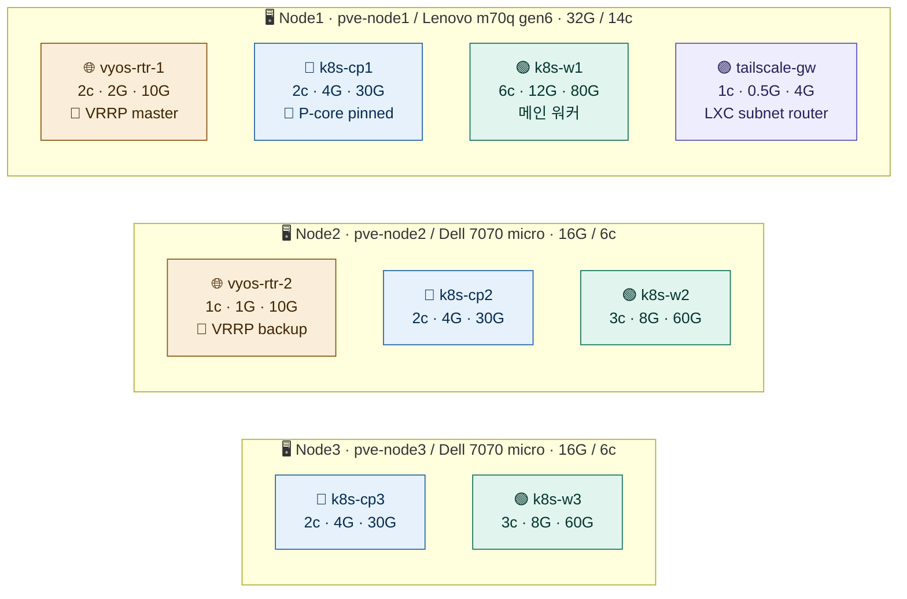
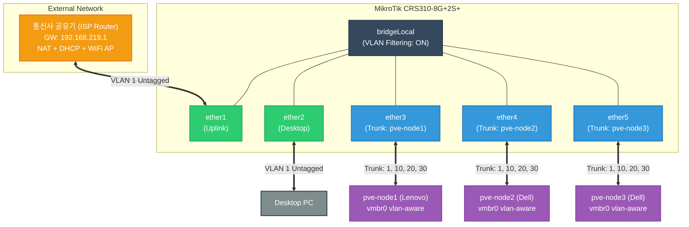

# Homelab
<!-- toc -->

- [Todo](#todo)
  - [Phase0](#phase0)
  - [Phase1](#phase1)
  - [Phase2](#phase2)
  - [Phase3](#phase3)
  - [Phase4](#phase4)

<!-- tocstop -->

## VM 배치 토폴로지

## 네트워크 토폴로지

## Todo
### Phase0: VyOS Template 수동 제작
- [x] VyOS Rolling generic ISO에 cloud-init 부재 확인
- [x] Default apt repo 비활성 상태에서 외부 repo 일회성 활용
- [x] qemu-guest-agent 설치로 PVE → guest IP 자동 발견 가능
- [x] Bootstrap config로 clone 후 즉시 SSH 도달 가능
- [x] Template lock + cloud-init drive 부착
- [x] Clone 검증 (998)으로 모든 흐름 통과 확인

### Phase1: Terraform 첫 번째 VM 프로비저닝
- [x] PVE API 토큰 (terraform@pve!provisioner) 발급
- [x] Terraform Level 2.5 평면 구조 빌드
- [x] bpg/proxmox provider 0.66 설치 + 인증 동작
- [x] Template clone 첫 사이클 (apply 0 error)
- [x] Guest agent 통한 IP 자동 발견 (ipv4_addresses output)
- [x] External SSH 도달성 검증
- [x] VM 안에서 외부 ping 도달 (vlan1 default route 통해)

### Phase2: vyos-rtr-1 네트워크 설정
- [x] Hostname: vyos-rtr-1
- [x] vlan10/20/30 sub-interfaces (.252 IPs, descriptions)
- [x] NAT rules 100/110/120 (vlan10/20/30 → eth0 masquerade)
- [x] Firewall state-policy (set 명령 정상 박힘)
- [x] Routing: connected vlan10/20/30 + static default
- [x] External SSH 여전히 가능 (vlan1 DHCP IP 유지 — 디버깅 fallback)

### Phase3: VRRP HA 이중화 구성
- [x] Master/Backup 정확히 분리 (priority 200 > 100)
- [x] VRID matching (rtr-1과 rtr-2의 VRID 10/20/30이 정확히 매칭 → 같은 VRRP group으로 인식)
- [x] Last Transition이 1분대 — 가장 최근 apply에서 시작됐다는 증거
- [x] Sync-group ALL 동작 중 (3 group 모두 동일 상태)

### Phase4: IaC 리팩토링 및 Template 자동화
#### Terraform 모듈화
- [x] 평면(flat) 구조 → `modules/vyos-router/` 재사용 모듈 분리
- [x] `role = "master" | "backup"` 변수로 VRRP 우선순위 자동 계산
- [x] NAT 소스 네트워크 `cidrhost()` 동적 유도 (하드코딩 제거)
- [x] `moved {}` 블록으로 기존 state 무중단 마이그레이션 (`terraform plan`: 0 to add/change/destroy)
- [x] `modules/k8s-cluster/`, `modules/lxc-container/` 미래 모듈 스텁 생성
- [x] 완료 보고서 `docs/REFACTORING.md` 작성

#### Packer + Ansible — VyOS 템플릿 자동화
- [x] `packer/vyos-template/vyos-template.pkr.hcl` 작성
  - [x] `proxmox-iso` builder: ISO 다운로드 → VM 생성 → 부팅 → template 변환
  - [x] `boot_command`: `install image` 대화형 프롬프트 자동 응답 (VNC 키 주입)
  - [x] `boot = "order=scsi0;ide2"`: 설치 전 CDROM 폴백, 설치 후 디스크 GRUB 우선 부팅
  - [x] `build_ip` 고정 IP + `ssh_host` 지정으로 qemu-guest-agent 없이 SSH 접속
  - [x] `cloud_init_storage_pool`: PVE 호환용 cloud-init drive 자동 추가
  - [x] `nohup` 기반 DHCP 리셋 → template에 build_ip 잔류 방지
- [x] `ansible/vyos-template/playbook.yml` 작성
  - [x] VyOS 기본 설정 (hostname, timezone, DNS) via vbash
  - [x] Debian Bookworm repo 임시 추가 → qemu-guest-agent 설치 → repo 즉시 제거
  - [x] 검증 tasks: agent 상태, 잔존 repo, 패키지 설치 확인
- [x] Packer + Ansible 빌드 실행 완료 (Ansible `ok=14 changed=7 failed=0`)
